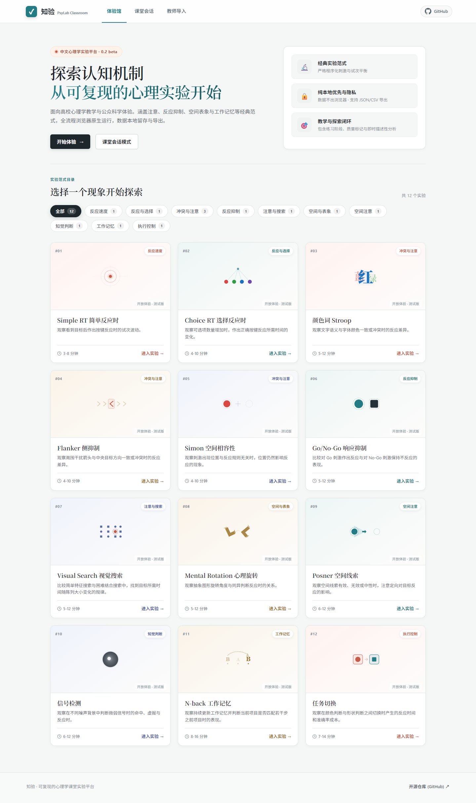
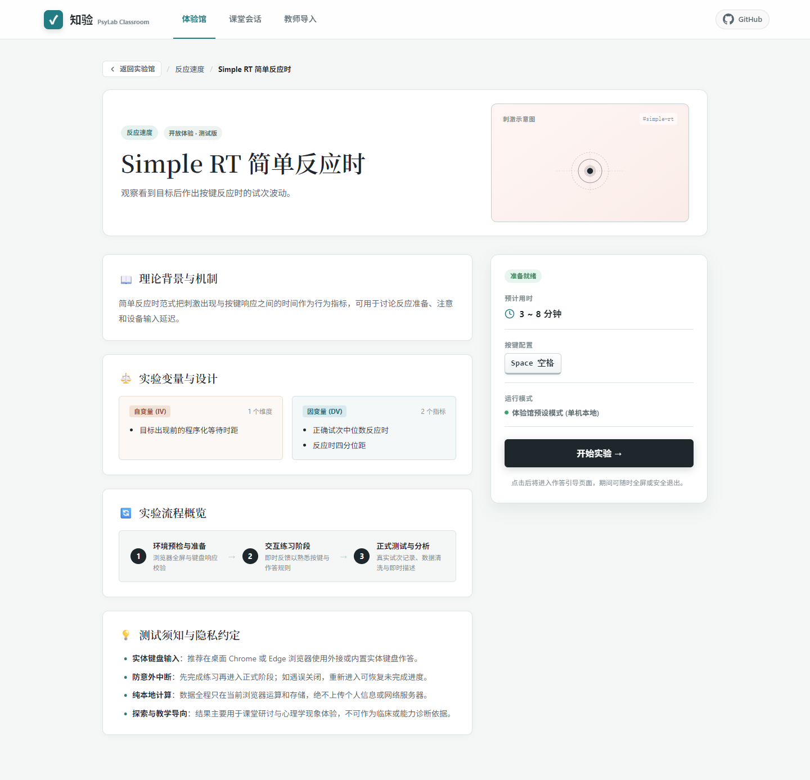
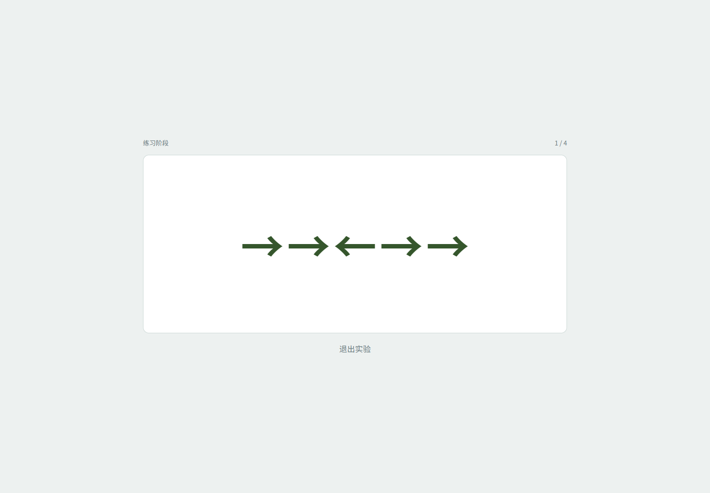
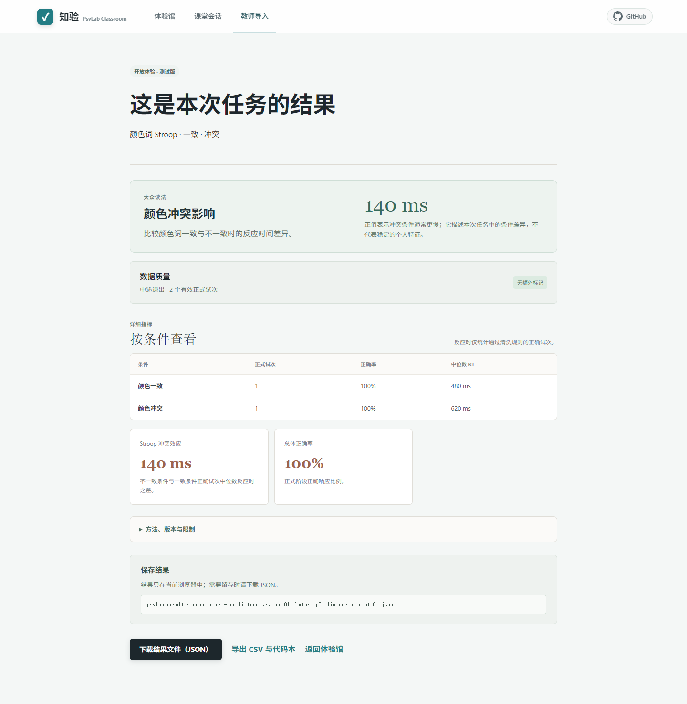
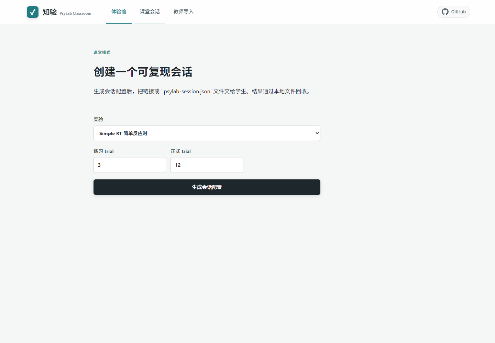
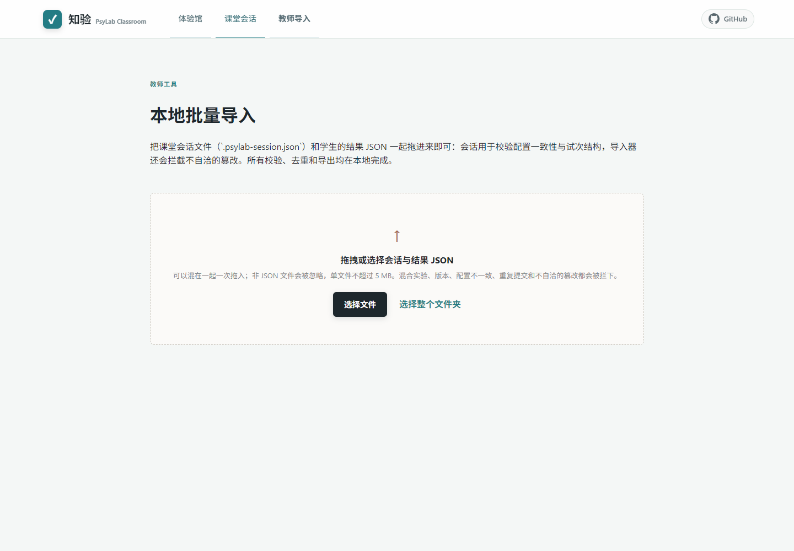

# 知验

**知验——可复现的心理学课堂实验平台**

*英文技术名：PsyLab Classroom。*

把经典心理实验带进真实课堂，从可复现的心理实验开始。

**在线体验：[byjming.github.io/psylab-classroom](https://byjming.github.io/psylab-classroom/)**

知验是面向中国大陆高校心理学教学与公众科学体验的开源、浏览器原生心理实验平台：打开网页即可运行实验，完成练习与正式试次，查看本次任务的描述性指标，并导出可导入的本地结果包。



---

## 这个平台能做什么

- **体验馆**：选择一个经典实验，几分钟完成，查看本次任务的描述性结果。
- **课堂模式**：教师生成本地会话配置分发给学生；学生在自己的浏览器完成实验并下载结果包；教师在本地批量导入、校验与汇总。
- **实验包仓库**：每个实验公开 Definition、参数 schema、程序化刺激、指标说明、许可清单和固定随机种子样例，可复现、可审阅。

## 当前实验目录

当前官方目录包含以下 `open / beta` 实验，目录会继续扩充；候选范式与筛选标准见 [实验目录与筛选标准](docs/experiment-catalog.md)。

| 实验 | 观察的现象 | 主要指标 | 预计用时 |
|---|---|---|---|
| Simple RT 简单反应时 | 反应速度与试次波动 | 中位数反应时、离散度 | 3–8 分钟 |
| Choice RT 选择反应时 | 选择数量对反应时的影响 | 2 选 1 / 4 选 1 条件差 | 4–10 分钟 |
| 颜色词 Stroop | 刺激维度冲突 | 冲突效应、正确率 | 5–12 分钟 |
| Flanker 侧抑制 | 周边干扰与选择反应 | 一致/不一致差值 | 4–10 分钟 |
| Simon 空间相容性 | 位置与反应规则冲突 | Simon 效应 | 4–10 分钟 |
| Go/No-Go 响应抑制 | 响应抑制 | 命中率、虚报率 | 5–12 分钟 |
| Visual Search 视觉搜索 | 特征与结合搜索 | 搜索斜率、正确率 | 5–12 分钟 |
| Mental Rotation 心理旋转 | 空间旋转判断 | 角度斜率、正确率 | 5–12 分钟 |
| Posner 空间线索 | 空间注意定向 | 线索效应、正确率 | 6–12 分钟 |
| Signal Detection 信号检测 | 敏感性与判断标准 | d'、c、命中/虚报 | 6–12 分钟 |
| N-back 工作记忆 | 在线更新与匹配 | 负荷成本、命中/虚报 | 8–16 分钟 |
| Task Switching 任务切换 | 规则重配置成本 | 切换成本、正确率 | 7–14 分钟 |

## 快速体验（学生 / 公众）

1. 打开站点，在首页实验目录选择一个实验，进入详情页。
2. 阅读实验说明、理论背景、变量和按键规则，点击“开始实验”。
3. 先完成带反馈的**练习阶段**（不计入摘要），再进入**正式阶段**。
4. 完成后查看结果页：主指标、按条件统计和数据质量标记。
5. 需要留存或提交时，下载 `.json` 结果文件，也可以导出 CSV 与代码本。



*详情页在开始前列明实验背景、自变量/因变量、按键规则和本地运行提示。*



*通过预检后进入说明和按键引导；运行时记录练习/正式阶段、响应窗、失焦和中断状态。*



*结果页只描述本次任务表现；原始 trial、清洗规则和版本信息随结果包导出。*

## 课堂使用（教师教程）

### 第 1 步：创建课堂会话

进入“课堂会话”页，选择实验、设置练习与正式 trial 数，生成会话配置。页面提供可复制的会话链接和 `.psylab-session.json` 会话文件；配置哈希（`configHash`）随会话固定，保证全班使用同一套参数。



### 第 2 步：分发给学生

把会话链接或会话文件发给学生。学生在自己的浏览器打开链接，填写**匿名参与者代码**（不要求姓名学号）后开始实验。中途退出会自动保存草稿，下次打开可继续。

### 第 3 步：回收结果

学生完成后下载各自的 `.json` 结果文件，通过班级既有渠道（网盘、邮件、U 盘等）交回。

### 第 4 步：本地批量导入

进入“教师导入”页，把会话文件和全部学生结果一起拖入。导入器在**本地**完成：

- 校验格式、Definition/指标/分析规则版本、发布层级与配置哈希；
- 用固定随机种子重建试次计划，拦截结构或程序化字段被篡改的文件；
- 逐试次复核 `correct`、排除标记与响应窗边界；
- 拦截重复提交与混合实验，提醒同一参与者的多次尝试；
- 生成批量 trial CSV、参与者摘要 CSV、代码本和错误报告。



## 数据与隐私

- 数据默认留在完成实验的浏览器（IndexedDB），导出为本地文件。
- 使用匿名参与者代码；请勿在代码中填写真实身份信息。
- 结果包不包含姓名、学号、IP、设备指纹或健康信息。
- 详见 [隐私、合规与风险](docs/privacy-and-risk.md)。

## 部署

PsyLab 是纯静态站点：`pnpm build` 后将 `dist/` 原样发布即可，支持 GitHub Pages（仓库自带 workflow）、Cloudflare Pages、高校静态服务器或离线镜像。详见 [静态部署](docs/deployment.md)。

## 本地开发

需要 Node.js 20+ 与 pnpm：

```bash
pnpm install
pnpm dev          # http://localhost:5173/
```

验证命令：

```bash
pnpm typecheck    # TypeScript 类型检查
pnpm lint         # ESLint
pnpm test         # Vitest 单元测试（契约、确定性、指标、导入校验）
pnpm build        # 类型检查 + 生产构建
```

技术栈为 React + TypeScript + Vite + jsPsych，实验采用统一的 `Definition / Runner / Metrics` 模型；机器可读契约位于 `schemas/`。新增实验的最小要求与验收清单见 [AGENTS.md](AGENTS.md) 与 [实验目录与筛选标准](docs/experiment-catalog.md)。

## 文档

- [产品与范围](docs/product-and-scope.md) · [技术架构](docs/architecture.md) · [数据契约](docs/data-contract.md)
- [实验目录与筛选标准](docs/experiment-catalog.md) · [实验包格式](docs/experiment-package-format.md)
- [隐私、合规与风险](docs/privacy-and-risk.md) · [路线图与质量门槛](docs/roadmap-and-quality.md)
- [静态部署](docs/deployment.md) · [数据迁移说明](docs/migrations.md) · [课程试用记录模板](docs/course-trial-feedback-template.md)
- Schema：[实验定义](schemas/experiment-definition.schema.json) · [会话清单](schemas/session-manifest.schema.json) · [结果包](schemas/result-bundle.schema.json)
- [贡献指南与 DCO](CONTRIBUTING.md)

## 边界声明

- 发布层级与技术优先级分离：`open`（公众与课堂）、`guided`（需增强提示、参与者确认与 debrief）、`controlled`（受控部署）。当前官方目录以 `open` 为主。
- 不纳入临床筛查、诊断、强刺激、摄像头/麦克风/生理采集与许可不清的材料。
- 浏览器反应时受设备与输入延迟影响，不用于跨设备排名；不宣称实验室设备级时序精度。

## 许可

- 代码：[Apache-2.0](LICENSE)
- 教学文档与实验说明：CC BY 4.0
- 原创程序化刺激与样例数据：CC0 或各实验 `LICENSES.md` 中单独声明的宽松许可
- 第三方材料必须保留来源、许可与版本信息，不因进入仓库而自动获得开源许可

贡献须遵守 [DCO](CONTRIBUTING.md#developer-certificate-of-origin)，不得提交真实课堂数据、个人信息或未经许可的材料。
