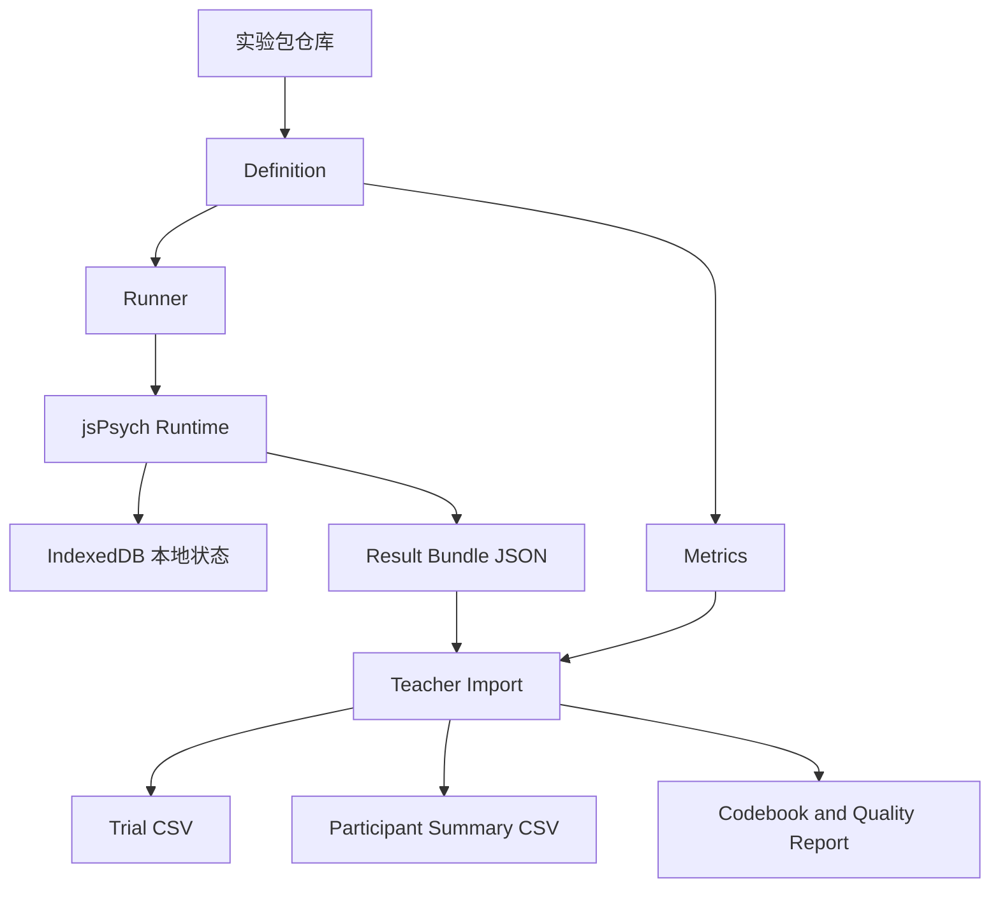

# 技术架构

## 1. 架构原则

1. **浏览器原生**：实验运行只依赖标准 Web API 与打包后的 jsPsych 插件。
2. **本地优先**：实验数据默认不离开浏览器；网络只用于加载静态资源。
3. **契约优先**：实验定义、结果包和指标规则先于页面组件设计。
4. **可复现**：实验版本、配置、随机种子和分析规则必须随结果保存。
5. **教学优先**：支持受控预设，避免把通用作者工具的复杂度推给教师。
6. **可替换部署**：同一构建产物可部署到 GitHub Pages、Cloudflare Pages、高校静态服务器或离线镜像。

## 2. 系统分层



## 3. 推荐目录

```text
apps/
  web/                 # 体验馆、课堂运行页、教师导入页
packages/
  schema/              # Definition、Session、Result Bundle schema
  runtime/             # jsPsych 初始化、预检、生命周期、存储
  experiments/         # 实验 Definition、刺激和参数 schema
  metrics/             # 纯函数指标与清洗规则
  import-export/       # CSV、JSON、批量导入、报告
  ui/                  # 与实验无关的中文 UI 组件
docs/
schemas/
fixtures/
  experiments/         # 固定随机种子的样例输入和预期指标
  results/             # 结果包夹具
```

## 4. Definition / Runner / Metrics

### Definition

Definition 是可序列化的实验元数据和配置声明，不直接操作 DOM。它应描述：

- `experimentId`、`definitionVersion`、标题和语言。
- 目的、理论背景、设计、自变量、因变量和适用课程。
- 参数 schema、默认值、最小/最大值和兼容性提示。
- `runPolicy`：发布层级、公共目录可见性、教师确认和事后解释要求。
- 刺激资源或程序化刺激的版本。
- trial 类型、条件标签和预期响应。
- 指标名称、单位、排除规则和已知限制。
- 内容许可和来源。

### Runner

Runner 将已验证的 Definition 编译为 jsPsych timeline，并负责：

- 浏览器/设备预检。
- 资源预加载。
- 练习与正式阶段切换。
- 随机种子初始化和条件随机化。
- 失焦、页面隐藏、全屏退出和异常退出记录。
- 每个 trial 完成后的本地持久化。
- 完成后的结果包导出。
- 根据 `runPolicy` 约束入口：公共站点可显示 `open` 和带增强提示的 `guided`；`controlled` 不在默认构建中启用。`guided` 运行前必须完成参与者确认，结束后必须完成 debrief。

### Metrics

Metrics 必须是无 DOM、副作用的纯函数。输入是规范化 trial 数据和分析规则，输出包括：

- 原始统计量。
- 清洗后统计量。
- 每个条件的有效 trial 数。
- 被排除 trial 的原因。
- 质量标记。
- `metricsVersion`。

禁止在 Metrics 中输出诊断、人格类别、能力等级或医学建议。

## 5. 实验发布策略

`runPolicy.tier` 与实现稳定性是两个独立轴：

- `open`：可出现在体验馆；运行前提供简短说明，完成后给出方法解释。
- `guided`：可以在公共目录中展示，但 Runner 必须显示增强告知、取得参与者确认，并在完成后显示不可跳过的 debrief；课堂部署仍可选择只通过教师会话分发。
- `controlled`：Definition 和源码可以开源，但默认站点不列出、不加载；部署者负责材料审查、参与者告知和本地伦理要求。

前端检查只能提供流程约束，不能证明教师资格、伦理审批或参与者真实身份。公共可见也不代表平台对所有场景作出适用性保证。

## 6. 浏览器运行约束

- MVP 仅保证 Chrome/Edge 最新两个大版本的桌面环境。
- 移动端可展示说明或结果，不承诺键盘反应时质量。
- Safari 全屏键盘行为存在兼容性限制，应显示提示并允许退出全屏。
- 预检至少包括键盘响应、Viewport、页面可见性、存储可用性和资源加载。
- 不使用外部运行时 CDN；依赖通过 Vite 固定打包。
- 不把 `performance.now()` 或浏览器 `rt` 解释成实验室设备级时序。

## 7. 本地存储

IndexedDB 保存：

- 当前实验状态和已完成 trial。
- 会话 manifest 与随机种子。
- 未导出的结果包。
- 最后一次导出时间和导出校验摘要。

localStorage 只保存非敏感偏好，例如语言和说明页设置。用户清空浏览器数据、使用隐私模式或更换设备可能导致未导出数据丢失；界面必须在运行前提示并在完成后强制引导导出。

## 8. 会话链接

优先格式：

```text
https://host.example/run#/<compressed-session-manifest>
```

fragment 不会随 HTTP 请求发送给静态服务器，但仍可能出现在浏览器历史记录中，因此 manifest 不得包含个人信息。配置过长或需要保护的内容使用会话文件导入。无后端时短代码不能独立解析，不能承诺“输入一个代码就能找回任意会话”。

## 9. 部署

构建产物必须是纯静态文件。支持：

- GitHub Pages：开源演示。
- Cloudflare Pages：公共镜像。
- 高校自有静态服务器：课堂主部署。
- 离线静态镜像：网络不稳定场景。

静态托管不等于零数据暴露：主机可能记录访问日志和 IP。产品默认关闭第三方统计、广告、远程字体和外部资源，并在隐私说明中明确部署方日志责任。

## 10. 可选后端边界

MVP 不实现收集后端。后续如有学校要求中央收集，优先提供自托管适配层（例如 JATOS），并保持同一 Result Bundle schema。后端不是核心实验运行时，也不能成为默认依赖。
